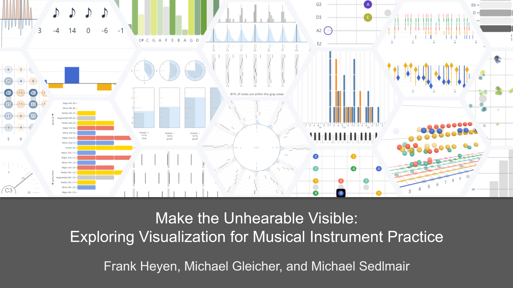

# MILA - Musical Instrument Learning Apps

A collection of web-based apps for musical instrument practice.

[online demo](https://visvar.github.io/mila/)

[video (YouTube)](https://www.youtube.com/watch?v=qMQjerAGw9Y) | [video (download)](https://github.com/visvar/mila/raw/refs/heads/main/doc/supplemental-video-small.mp4)

[DOI to TVCG](https://doi.org/10.1109/TVCG.2026.3658216) | [arXiv](https://arxiv.org/abs/2601.16708)

citation:
<pre style="font-family: monospace;">
@article{heyen2026make,
  title    = {Make the Unhearable Visible: Exploring Visualization for Musical Instrument Practice}, 
  author   = {Heyen, Frank and Gleicher, Michael and Sedlmair, Michael},
  journal  = {IEEE Transactions on Visualization and Computer Graphics (TVCG)}, 
  year     = {2026},
  pages    = {1-17},
  doi      = {10.1109/TVCG.2026.3658216}
  keywords = {Music;Instruments;Data visualization;Visualization;Education;Prototypes;Aerospace electronics;Timing;Musical instruments;Games;Temporal data;application-motivated visualization;education;personal visualization;music;instrument practice},
}
</pre>

## What You Need to Use the Demo

Most apps require a MIDI instrument, though a few work with audio or allow you to use a PC keyboard or touch screen.

While several apps should work with any (MIDI) instrument, we only tested them with keyboard, e-drum, and a [MIDI guitar pickup](https://www.fishman.com/tripleplay/).

## Setup

This is only necessary for local testing or development.
If you just want to use the apps, go [here](https://visvar.github.io/mila/).

- Install NodeJS and npm
- Clone/download this repository
- `cd mila`
- `npm i`
- `npm start`
- Open the URL shown in the console

## Used Libraries and Packages

- [Svelte](https://svelte.dev/) components
- [Observable Plot](https://observablehq.com/plot/) visualization
- [D3](https://d3js.org/) scales, data processing
- [tonal](https://github.com/tonaljs/tonal) music theory such as scales, chords, progressions
- [musicvis-lib](https://github.com/fheyen/musicvis-lib) more technical musical functions
- [pitchy](https://github.com/ianprime0509/pitchy) pitch detection from audio
- [fflate]([fflate](https://www.npmjs.com/package/fflate)) compression of share links
- [webmidi](https://github.com/djipco/webmidi) Web MIDI API wrapper
- [fast-kde](https://github.com/uwdata/fast-kde) density estimation
- [a-frame](https://aframe.io/) for the 3D fretboard design
- [@fontsource](https://github.com/fontsource/fontsource) noto-music, noto-sans, noto-sans-symbols, noto-sans-symbols-2 for cross-plattform note symbols and icons
- [https://github.com/danigb/soundfont-player](soundfont-player) and [midi-js-soundfonts](https://github.com/gleitz/midi-js-soundfonts) for playback
